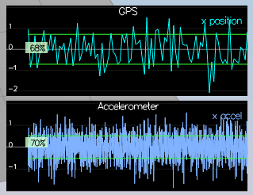
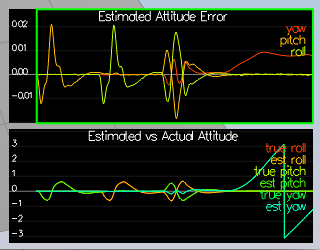
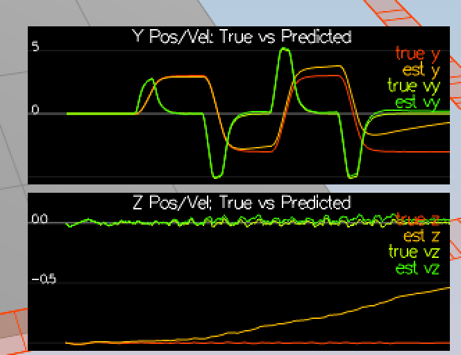
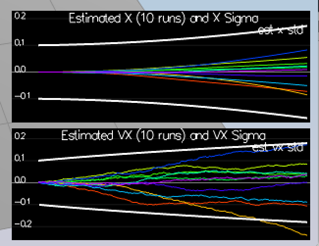

# WRITEUP

### Step 1: Sensor Noise

Using a break point in `main.cpp` `OnTimer` function, I was able to catch the logs with 99 points. These logs were saved as `Graph1_full.txt` and `Graph2_full.txt`.

With `pandas` `read_csv()` and `describe()` the found standard deviations were:
```
MeasuredStdDev_GPSPosXY = 0.717481
MeasuredStdDev_AccelXY = .512272
```



### Step 2: Attitude Estimation

The estimated roll, pitch and yaw were obtained using the quaternion conversion. The baked in function `IntegrateBodyRate` for `Quaternion<float>` takes care of the integration calculation.

Additional yaw radian standardization was done afterwards.



### Step 3: Prediction Step

The first half of Step 3 is writing `PredictState`. 

This function is the combination of two vectors `g1` and `g2`, as show in the "Estimation for Quadrotors" paper.

`g1` is the position integration step while the `g2` is the velocity integration step. 

`g1` simply uses its own values in the 3, 4, 5 indicies, multiplies them by the `dt` and adds them to the 0, 1, 2 indicies. 

`g2` is calculated by using the hints, `attitude.Rotate_BtoI(accel);`. The values from the indicies 0, 1, 2 of the resulting vector are set at the 3, 4, 5 indicies of `g2`.

These two are added together to make the `predictedState`.



`GetRbgPrime` is simply setting the correct values of `sin` and `cos` with `roll`, `pitch` and `yaw` basecd on formula (52) in "Estimation for Quadrotors".

For the full `Predict`, the Jacovbian is calculated first. As formula (51) shows, the `dt` is set at (0, 3), (1, 4), (2, 5). Additionally, the `accel` `V3F` is converted to a `VectorXf` and multiplied with the `GetRbgPrime` written prior as well as `dt`. The value for this result vector is set at (3, 6), (4, 6), and (5, 6).

Finally, the complete covariance is calculated by matrix multiplication of the `gPrime`, previous `ekfCov`, and `gPrimeTransposed` plus `Q`.



### Step 4: Magnetometer Update

The `UpdateFromMag` was simply written by setting `hPrime(0, 6) = 1.0;` and setting `zFromX` to the estimated yaw of `ekfState(6)` (with normalization based on the diff between measured and estimated).

Additionally, the `QYawStd` was raised to `.35`.